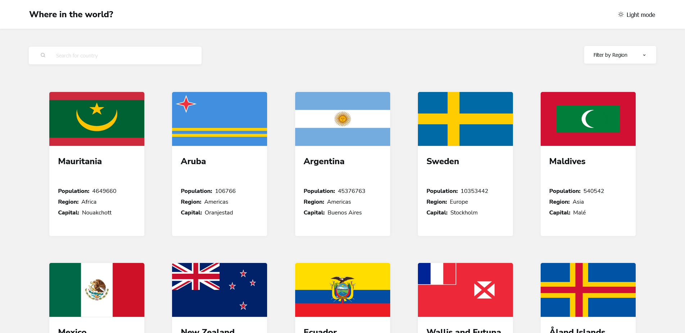
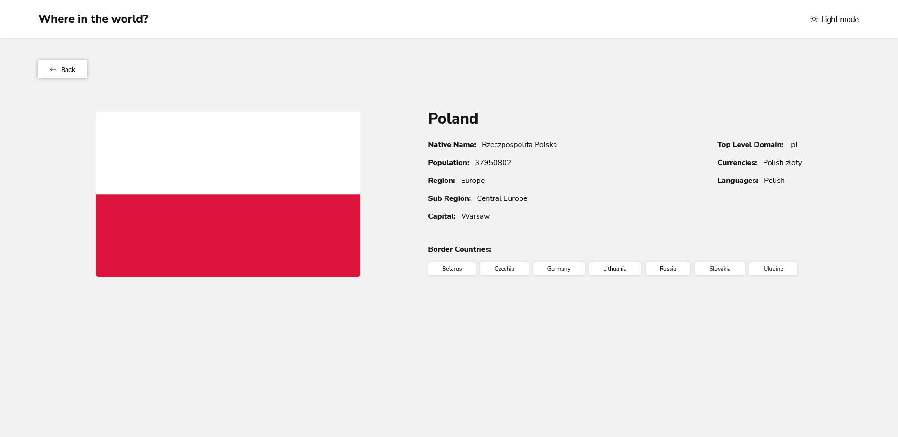
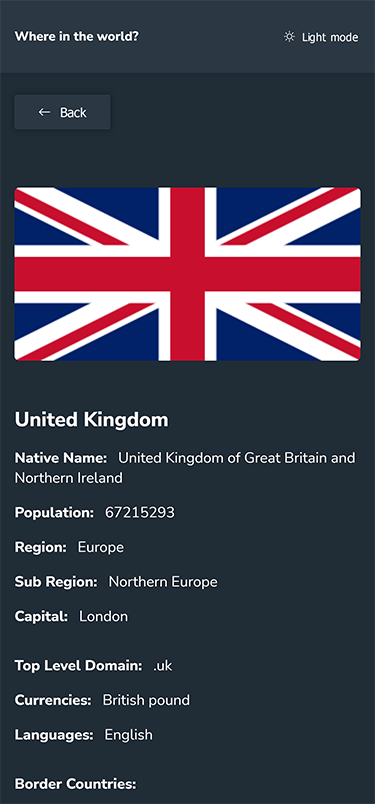

# Getting Started with Create React App

This project was bootstrapped with [Create React App](https://github.com/facebook/create-react-app).

## Start the project

Run:

### `npm start`

# Frontend Mentor - Todo App

This is a solution to the [REST Countries API with color theme switcher](https://www.frontendmentor.io/challenges/rest-countries-api-with-color-theme-switcher-5cacc469fec04111f7b848ca).

## Table of contents

- [Overview](#overview)
  - [Screenshot](#screenshot)
  - [Links](#links)
- [My process](#my-process)
  - [Built with](#built-with)

## Overview

User is able to:

- See all countries from the API on the homepage
- Search for a country using an `input` field
- Filter countries by region
- Click on a country to see more detailed information on a separate page
- Click through to the border countries on the detail page
- Toggle the color scheme between light and dark

### Screenshot

### Links

- Solution URL: [code](https://github.com/waldekglaz/rest-countries-api)
- Live Site URL: [live](https://rest-countries-wg.netlify.app/)

## My process

### Built with

- React Js with CSS modules, [uniqid](https://www.npmjs.com/package/uniqid), [use-local-storage](https://www.npmjs.com/package/use-local-storage), [react-icons](https://react-icons.github.io/react-icons), [react-loader-spinner](https://www.npmjs.com/package/react-loader-spinner)
- Mobile-first

## Author

- Frontend Mentor - [@waldekglaz](https://www.frontendmentor.io/profile/waldekglaz)
